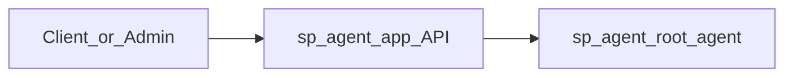

## CANB AI CARE AGENT 프로젝트

CANB AI CARE AGENT는 학생의 **성적·학습 습관·출결 등 학습 데이터**를 기반으로  
Google ADK(Agent Development Kit) 위에서 동작하는 `sp_agent`를 이용해  
**상담 가이드를 자동 생성하는 에이전트 시스템**입니다.

현재 실제로 사용하는 런타임 구조는 다음 두 컴포넌트에 집중되어 있습니다.

- **`sp_agent`**: 상담 에이전트 파이프라인 및 knowledge
- **`sp_agent_app`**: `sp_agent`를 호출하는 FastAPI 기반 HTTP API

루트의 `Dockerfile` 역시 `sp_agent_app.main:app` 을 기동하도록 설정되어 있습니다.

---

## 아키텍처 개요



- **Client / Admin**
  - 내부 관리 콘솔, 배치 잡, 백엔드 서비스 등에서 HTTP로 `sp_agent_app` API를 호출합니다.
- **`sp_agent_app` (FastAPI)**
  - Google ADK `Runner` + `InMemorySessionService` 를 사용해 `root_agent`를 실행합니다.
  - `/counsel`, `/batch-counsel` 엔드포인트로 단건/배치 상담을 제공합니다.
- **`sp_agent` (ADK Agents)**
  - 학생 데이터 부트스트랩 → 케이스 분류 → 상담 가이드 생성을 순차적으로 수행하는 ADK 에이전트 집합입니다.


---

## 디렉터리 구조 

- **`sp_agent/`** – 상담 에이전트 및 도메인 로직
  - `agent.py`
    - Google ADK `SequentialAgent` 기반 `root_agent` 정의
    - 서브 에이전트 체인:
      - `StudentDataBootstrapAgentV2`
      - `case_selector_agent`
      - `counseling_parallel_agent`
  - `knowledge/`
    - `CANB_CARE_Case_Classification.md`: 케이스 분류 기준 문서
    - `case_guides.yaml`: 케이스별 상담 가이드 템플릿/지식
  - `sub_agents/`
    - `case_selector/`: case code 선택 에이전트
    - `counseling_generator/`: 상담 가이드(5개 섹션) 생성 에이전트
    - `data_bootstrap/`: 외부 데이터/분석 결과를 세션 상태로 적재하는 에이전트
  - `mapping.py`
    - 성적/학습/출결 등의 분석 JSON을 `feature_json` 등의 형태로 변환하는 유틸리티
  - `raw_data_sample/`
    - 실제 API 연동 전 테스트에 사용할 수 있는 샘플 JSON
  - `requirements.txt`
    - ADK, GenAI, FastAPI 실행에 필요한 패키지 목록

- **`sp_agent_app/`** – HTTP API 레이어
  - `main.py`
    - FastAPI 앱 정의
    - 헬스체크 및 `/counsel`, `/batch-counsel` 엔드포인트
  - `config.py`
    - 환경 변수 기반 설정 로직 (`concurrency_limit`, `batch_chunk_size` 등)
  - `models.py`
    - `BatchCounselItemV2`, `BatchCounselPayloadV2`, `CounselResult`, `BatchCounselResponse` 등의 Pydantic 모델

- **루트 디렉터리**
  - `Dockerfile`
    - `sp_agent_app.main:app` 을 Cloud Run 등에서 실행하기 위한 컨테이너 이미지 정의
  - `requirements.txt`
    - 의존성 파일. 

---

## 로컬 개발 환경 설정

### 1. 필수 요구 사항

- Python 3.12
- `virtualenv` 또는 `python -m venv`
- Google GenAI / ADK 관련 인증 정보
  - 예: `GOOGLE_API_KEY` 

### 2. 가상환경 생성 및 의존성 설치

```bash
cd /path/to/canb_ai_care_agent

python -m venv venv
source venv/bin/activate  # Windows: venv\Scripts\activate

pip install --upgrade pip
pip install -r requirements.txt
```

### 3. 환경 변수 설정 (예시)

```bash
export OPENAI_API_KEY="YOUR_API_KEY"
# 필요 시 추가 환경 변수 (프로젝트/리전, 모델 설정 등)
```

---

## 서비스 실행 방법 (`sp_agent_app`)

`sp_agent_app` 는 현재 이 프로젝트에서 실제로 사용하는 **메인 HTTP 엔드포인트**입니다.

```bash
uvicorn sp_agent_app.main:app --host 0.0.0.0 --port 8080 --reload
```

- **헬스체크**
  - `GET http://localhost:8080/health`
- **단건 상담**
  - `POST http://localhost:8080/counsel`
- **배치 상담**
  - `POST http://localhost:8080/batch-counsel`


---

## `sp_agent_app` API 개요

### 1. 단건 상담 – `POST /counsel`

- 요청 바디 타입: `BatchCounselItemV2`
- 주요 필드 (요약):
  - `member_code`: 학생 ID
  - `exam_test_code`: 시험 코드
  - `exam_div`, `exam_name`: 시험 구분/이름
  - `course_code`: 과목 코드
  - `student_performance`:
    - `score_analysis`: 점수/성취도 및 분석 기간 (`analysis_period.start`, `analysis_period.end`)
    - `learning_routine`: 학습 루틴 관련 정보
    - `attendance`: 출결 정보

내부적으로는 `_split_and_build_state_from_v2_item` 을 통해:

- `raw_json`: 해당 시험의 종합 분석 데이터
- `feature_json`: 현재 학기와 이전학기의 trend를 exams, Readi, Alex 별로 정리한 JSON

을 생성하여 ADK 세션 상태에 주입하고, `run_root_agent_once(state)` 를 실행합니다.

- 응답 타입: `CounselResult`
  - `status`: `"success"` 또는 `"error"`
  - `analysis_result`: 성공 시 상담 가이드 JSON

### 2. 배치 상담 – `POST /batch-counsel`

- 요청 바디 타입: `BatchCounselPayloadV2`
  - `batch_data`: `BatchCounselItemV2` 리스트
- 내부 동작:
  - 설정된 `concurrency_limit` 만큼 동시에 상담을 실행
  - `batch_chunk_size` 단위로 청크를 나누어 순차 처리하면서도 청크 내에서는 비동기로 병렬 실행
  - 각 항목에 대해 `run_root_agent_once(state)` 를 호출
- 응답 타입: `BatchCounselResponse`
  - `total`: 전체 처리 건수
  - `results`: `CounselResult` 리스트

---

## 내부 에이전트 파이프라인 (`sp_agent`)

`sp_agent/agent.py` 에는 다음과 같은 구조의 `root_agent` 가 정의되어 있습니다.

- **`StudentDataBootstrapAgentV2`**
  - 외부 API/데이터 소스에서 학생 관련 원본 JSON 및 분석 결과를 세션 상태로 적재
  - `raw_json`, `feature_json`, 요약 정보 등을 생성
- **`case_selector_agent`**
  - 학생의 특성/성적 패턴을 기반으로 상담 케이스 코드(예: 위험군/성취군 등)를 선택
- **`counseling_parallel_agent`**
    - **`get_avoided_and_overall_agent`** : 지양표현 및 총평
    - **`get_data_guide_agent`** : 데이터 가이드 
    - **`get_behavior_agent`** : 행동
    - **`get_closing_agent`** : 마무리
  - 4개의 병렬 에이전트로 생성
  - 5개 섹션(예: 지양 표현, 총평, 데이터 해석 가이드, 행동, 마무리)을 `_merge_sections_from_state` 로 병합
  - 최종적으로 `generated_counseling_guide` 라는 단일 JSON으로 출력

이 파이프라인 전체가 `run_root_agent_once(state)` 한 번 호출로 실행되며,  
최종 상담 가이드 JSON이 `sp_agent_app` 의 `CounselResult.analysis_result` 로 반환됩니다.

---

## Cloud run 배포 

```dockerfile
CMD ["uvicorn", "sp_agent_app.main:app", "--host", "0.0.0.0", "--port", "8080"]
```

- 이 이미지를 기반으로 Cloud Run 등 컨테이너 런타임에 올려서 사용할 수 있습니다.
- 구체적인 GCP/Firebase 배포 스크립트는 `deploy/` 디렉터리의 deploy kit 으로도 배포 가능합니다.

- 배포 방법 간단 요약
1. 이미지 빌드 + GCP Artifact Registry 로 푸시
```
gcloud builds submit \
  --tag $region-docker.pkg.dev/$프로젝트_ID/$아티팩트_레포/$서비스_이름:태그 .
```

2. Cloud run 에서 해당 이미지 배포
태그가 latest 인 경우
```
gcloud run deploy sp-agent-app \
  --image=$region-docker.pkg.dev/$프로젝트_ID/$아티팩트_레포/$서비스_이름:latest \
  --platform=managed \
  --region=$region \
  --allow-unauthenticated \
  --port=8080
```
---

## 향후 개선 아이디어

- 모니터링 대시보드 연동 (성공률, 처리 시간)
- 에러 코드/메시지 표준화 및 클라이언트용 에러 가이드 문서화


